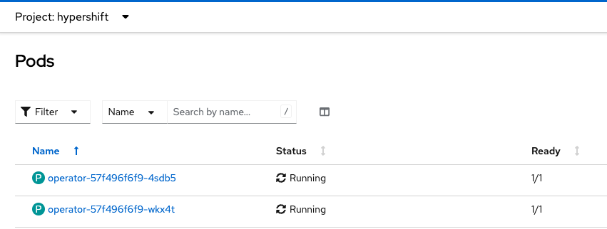
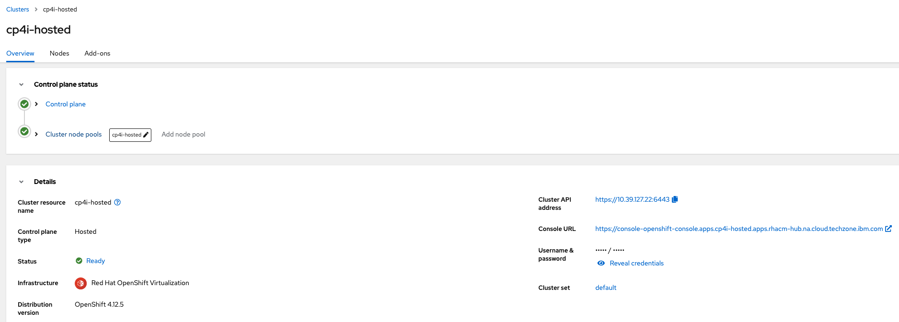
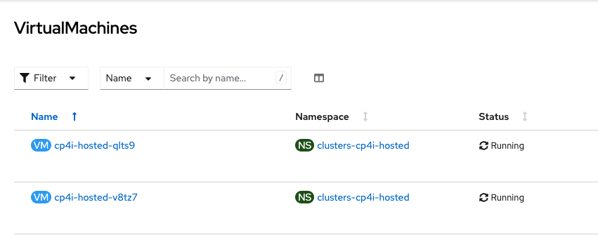

# HyperShift with KubeVirt

aka OpenShift Hosted Control Planes with OpenShift Virtualisation

## Benefits

* Run Managed (Hosted) OpenShift Cluster Control Plane as Pods within a RHACM Hub
* Run Managed OpenShift Cluster Worker Nodes as Virtual Machines within a RHACM Hub
* Spin up Managed OpenShift Clusters faster - Approx 15 mins
* Smaller resource footprint = cost benefits
* Strong isolation (Secruity) between Hosted Control Plane Pods and Worker nodes
* Manage different OpenShift versions under the same OpenShift Cluster
* Seperation of network traffic between Hosted Control Plane Pods and Worker nodes

## Cluster and Operators configuration

* OpenShift v4.12 (I've tested this on OpenShift v4.12.5)
* OpenShift Data Foundation v4.12
* OpenShift Virtualisation v4.12
* Red Hat Advanced Cluster Management (aka RHACM) v2.7, could just be MultiCluster Engine v2.2, but RHACM is a better option to choose
* MetalLB Operator v4.12

I'm not going to cover how to install/configure all the above Operators as there's plenty of documentation available out there, but I will cover the additional configuration steps required above the initial install/configuration.

### MultiCluster Engine (MCE)

If you used the RHACM operator, it would have automatically installed the MCE operator as part of it's deployment. If so, then all you need to do is `patch` the MCE Operator to enable the Dev Preview functionality.

```bash
$ oc patch mce multiclusterengine --type=merge -p '{"spec":{"overides":{"components":[{"name":"hypershift-preview","enabled":true}]}}}'
```

### HyperShift

Install the HyperShift Addon within the RHACM Hub (aka local-cluster)

```yaml
apiVersion: addon.open-cluster-management.io/v1alpha1
kind: ManagedClusterAddOn
metadata:
  name: hypershift-addon
  namespace: local-cluster
spec:
  installNamespace: open-cluster-management-agent-addon
```

Once enabled, you will be able to see the Operator Pods running within the `hypershift` namespace.



### MetalLB

We will use the MetalLB Operator to provide a Network Load Balancer for the Hosted Clusters API.

Firstly, we'll create the MetalLB instance

```yaml
apiVersion: metallb.io/v1beta1
kind: MetalLB
metadata:
  name: metallb
  namespace: metallb-system
```

Secondly, we'll create an IP address pool

```yaml
apiVersion: metallb.io/v1beta1
kind: IPAddressPool
metadata:
  name: ip-addresspool
  namespace: metallb-system
spec:
  addresses:
  - 10.39.127.20-10.39.127.26
  autoAssign: true
  avoidBuggyIPs: false
```

Finally, we'll create an L2Advertisement resource to advertise the IP addresses we specified in the previous step

```yaml
apiVersion: metallb.io/v1beta1
kind: L2Advertisement
metadata:
  name: l2-adv
  namespace: metallb-system
spec:
  ipAddressPools:
    - ip-addresspool
```

### Ingress Wildcard and DNS

By default, every OpenShift Cluster is deployed with an application ingress controller expecting a wildcard DNS record to be associated with it.

As we'll be using the KubeVirt (OpenShift Virtualisation) provider with HyperShift (Hosted Control Planes), it will by default, create Hosted Clusters with a subdomain of the RHACM Hub cluster.

For example, my RHACM Hub cluster has a default application ingress DNS entry of `*.apps.rhacm-hub.na.cloud.techzone.ibm.com`, which means once I deploy a Hosted Cluster, lets say called `cp4i-hosted`, with the HyperShift KubeVirt provider it will automatically create a subdomain of `*.apps.cp4i-hosted.apps.rhacm-hub.na.cloud.techzone.ibm.com`.

To allow this functionality to happen, we need to `patch` the RHACM Hub Application ingress controller to allow wildcard DNS routes.

```bash
$ oc patch ingresscontroller -n openshift-ingress-operator default --type=json -p '[{ "op": "add", "path": "/spec/routeAdmission", "value": {wildcardPolicy: "WildcardsAllowed"}}]'
```

## Deploy your Hosted Cluster

With everything configured an ready, we can now deploy our Hosted Cluster with OpenShift Virtualisation providing the Virtual Machines for use as Worker nodes.

### Create Namespace

This namespace will be used to hold our secrets, hostedcluster and nodepool resources.

```yaml
apiVersion: v1
kind: Namespace
metadata:
  name: clusters
```

### Create Secrets

A couple of secrets are required for our Hosted Cluster, one which will hold your OPenShift Pull Secret and the other which will provide an encryption key for the etcd within the Hosted Cluster.

#### Pull Secret

```yaml
apiVersion: v1
kind: Secret
metadata:
  name: ce-apac-pull-secret
  namespace: clusters
data:
  .dockerconfigjson: PULL_SECRET_HERE_IN_BASE_64
```

#### Etcd Encryption

```yaml
apiVersion: v1
kind: Secret
metadata:
  name: cp4i-hosted-etcd-encryption-key
  namespace: clusters
type: Opaque
data:
  key: ETCD_ENCRYPTION_KEY_HERE_IN_BASE_64
```

### Hosted Cluster CR

The following yaml will define our Hosted Cluster using OpenShift Virtualisation

```yaml
apiVersion: hypershift.openshift.io/v1beta1
kind: HostedCluster
metadata:
  name: cp4i-hosted
  namespace: clusters
spec:
  autoscaling: {}
  controllerAvailabilityPolicy: SingleReplica
  dns:
    baseDomain: ""
  etcd:
    managed:
      storage:
        persistentVolume:
          size: 4Gi
        restoreSnapshotURL: null
        type: PersistentVolume
    managementType: Managed
  fips: false
  networking:
    clusterNetwork:
    - cidr: 10.132.0.0/14
    networkType: OVNKubernetes
    serviceNetwork:
    - cidr: 172.31.0.0/16
  platform:
    kubevirt:
      baseDomainPassthrough: true
    type: KubeVirt
  pullSecret:
    name: cp4i-hosted-pull-secret
  release:
    image: quay.io/openshift-release-dev/ocp-release:4.12.5-x86_64
  secretEncryption:
    aescbc:
      activeKey:
        name: cp4i-hosted-etcd-encryption-key
    type: aescbc
  services:
  - service: APIServer
    servicePublishingStrategy:
      type: LoadBalancer
  - service: OAuthServer
    servicePublishingStrategy:
      type: Route
  - service: Konnectivity
    servicePublishingStrategy:
      type: Route
  - service: Ignition
    servicePublishingStrategy:
      type: Route
  - service: OVNSbDb
    servicePublishingStrategy:
      type: Route
  sshKey: {}
```

### Node Pools CR

Finally we'll define our Node Pools. These are what is used as Workers nodes for our Hosted Cluster

```yaml
apiVersion: hypershift.openshift.io/v1beta1
kind: NodePool
metadata:
  name: cp4i-hosted
  namespace: clusters
spec:
  clusterName: cp4i-hosted
  management:
    autoRepair: false
    upgradeType: Replace
  nodeDrainTimeout: 0s
  platform:
    kubevirt:
      compute:
        cores: 8
        memory: 16Gi
      rootVolume:
        persistent:
          size: 50Gi
        type: Persistent
    type: KubeVirt
  release:
    image: quay.io/openshift-release-dev/ocp-release:4.12.5-x86_64
  replicas: 2
```

After a period of around 15-30 minutes, you will have a fully deployed Hosted Cluster using OpenShift Virtualisation to create the Virtual Machines that will act as Worker nodes for your Cluster.



and within the Virtualisation console on your RHACM Hub cluster, you will see the Virtual Machines



Once deployed, you can utilise the OpenShift Cluster just as you would any other cluster.

## Conclusion

With the use of OpenShift Virtualisation with HyperShift, it opens up a range of possibilities for Cluster Provisioning and Hosting. It also demostrates how by leveraging multiple OpenShift capabilities, you can create really unique solutions.

At the moment, OpenShift Virtualisation with HyperShift is still in Dev Preview mode so I would not recommend for a Production environment, but as the product matures further, expect it to move to Tech Preview and the full supported release in the near future.